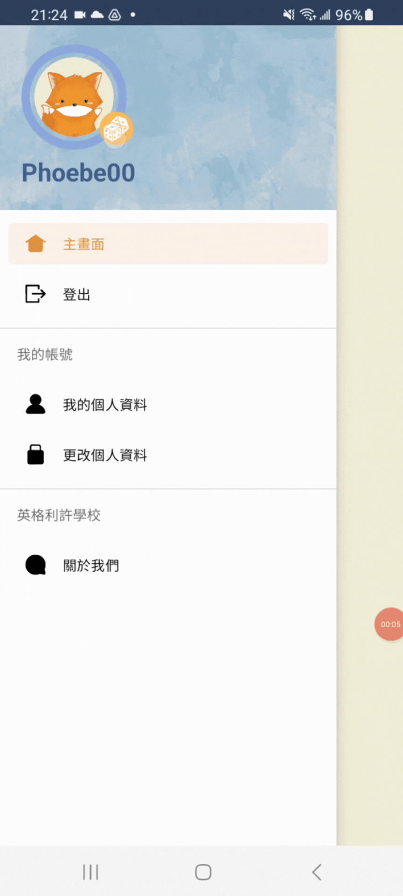

# English App

An English learning application for primary, junior high, and senior high school students in Taiwan.
 

## Introduction

This is a term project of Introduction to Database Systems course in FJU CSIE (fall semester 2022). Our purpose is to develop an **Android application** with more than 10k data. To make our application more fun, we originally designed our application features into 4 houses: Vocabulary, Reading , Phrase, and Competition House.

  

  
    
    
    

### Tools and Languages

        

### Contributors

Table of Contents

* [Tools and Languages](#tools-and-languages)
* [Screenshots](#screenshots)

## Demo

|Video        |Description  |
|  :----:     |:---         |  
||**Restration and Login** <ul><li>Set error on each edit text.</li><li>We set "user_phone" as a *primary key*.</li><li>When you succesfully login, the toast wil pop up.</li></ul>|
||**Main Screen** <ul><li>4 fragments: [Houses entrance](#houses_entrance), [Launge](#houses_entrance)(public message boards), [My dorm](#houses_entrance), and [Library](#houses_entrance).</li><li>Bottom navigation bar with animation.</ul>|
|  |**Drawer Menu & profile photo** <ul><li>Sliding animation.</li><li>Change the profile photo by clicking the orange dice icon, it will automatically save your change.</li><li>There're 5 photos in total</li></ul>|
||**tt** <ul><li>1</li><li>2</li><li>3</li></ul>|
||**tt** <ul><li>1</li><li>2</li><li>3</li></ul>|
||**tt** <ul><li>1</li><li>2</li><li>3</li></ul>|

## Screenshots

#### Login and Registration pages
